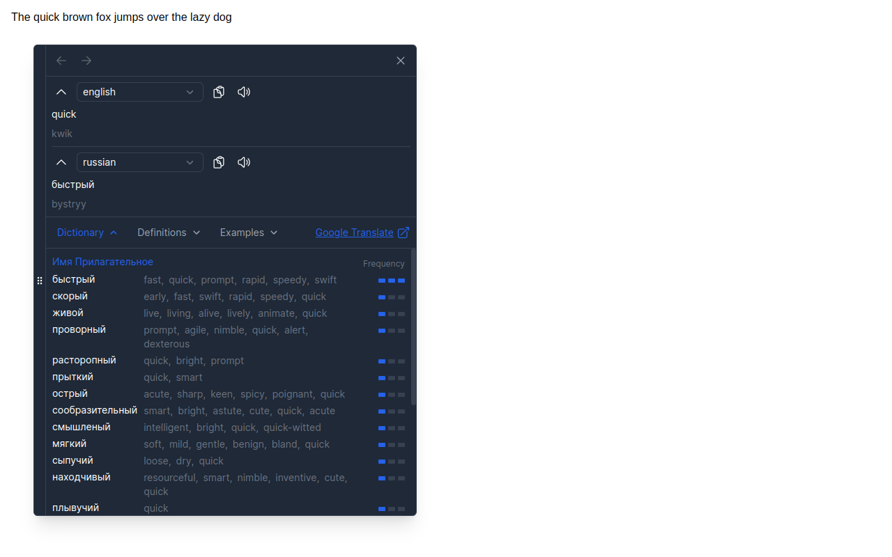

#  Translater

Translate selected text with Google Translate

***

<!--  -->

***

## Install

1. [FireFox Add-ons](https://addons.mozilla.org/firefox/addon/translater-gt)
<!-- 2. [Microsoft Edge Add-ons](https://qwe) -->
2. For Chrome (autoupdate are only supported for Linux users)

   * download from [releases page](https://github.com/chergav/translater/releases) `translater-n.n.n.zip` and unpack
   * open page `chrome://extensions/` and switch Developer mode on
   * drop `translater-n.n.n.crx` on page
