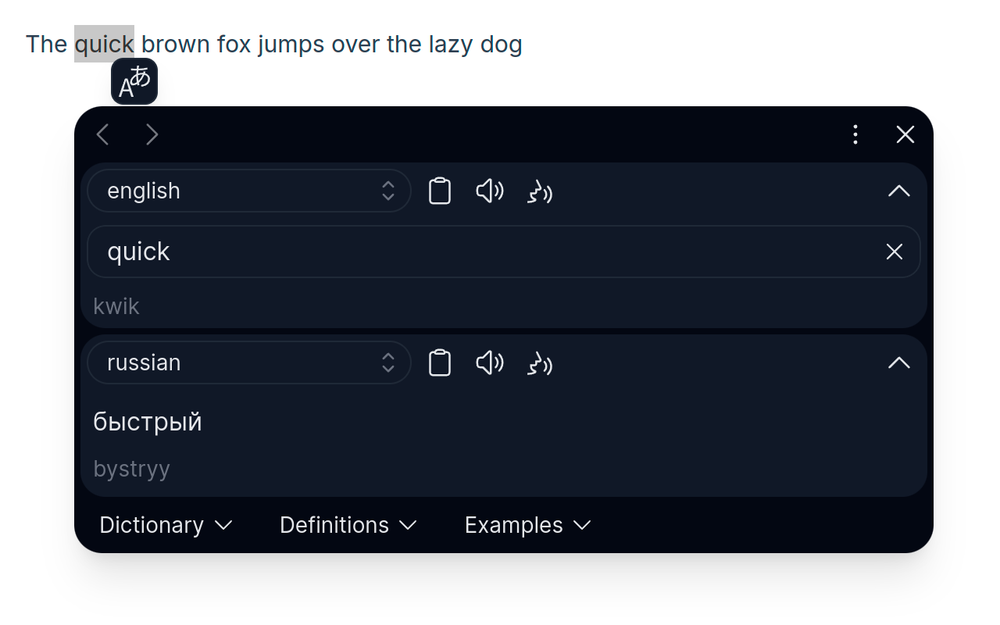

#  Translater

Translate selected text with Google Translate

***

<!-- 

 -->

<!-- Badges for chrome -->

<!-- Badges for edge -->

<!-- Badges for firefox -->

***

## Install

<!-- 1. [FireFox Add-ons](https://addons.mozilla.org/firefox/addon/translater-gt) -->
<!-- 2. [Microsoft Edge Add-ons](https://microsoftedge.microsoft.com/addons/detail/ohcoejhlajaopflplmckddjcfecgleij) -->
For other Chromium based browsers (autoupdate are only supported for Linux users)

   * download from [releases page](https://github.com/chergav/translater/releases) `translater-n.n.n.crx` (right-mouse button -> 'Save link as')
   * open page `chrome://extensions` and switch Developer mode on
   * drop `translater-n.n.n.crx` on page
